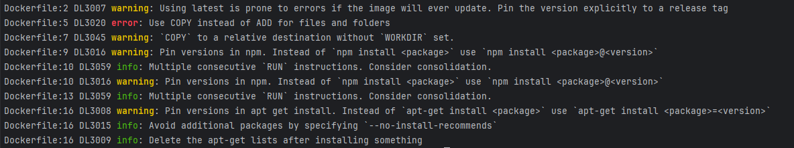
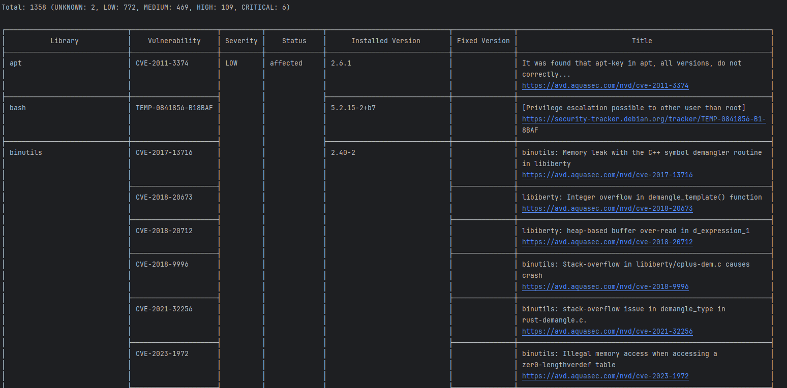
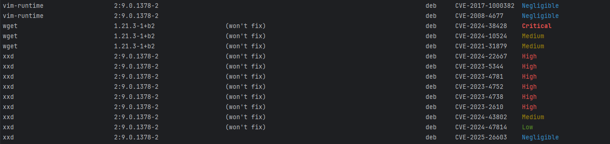

# Projet de Veille Technologique sur l'Outillage autour de la conteneurisation

Ce projet vise à renforcer la fiabilité des images de conteneurs en intégrant des outils d'analyse et en documentant le processus. Les résultats de cette veille technologique et les améliorations apportées seront partagés dans ce dépôt.

## Prérequis

Avant de commencer, assurez-vous d'avoir installé les outils suivants :

1. **Docker** : Assurez-vous que Docker est installé et en cours d'exécution sur votre machine. Vous pouvez télécharger Docker [ici](https://www.docker.com/get-started).

2. **Outils d'analyse** : Installez les outils suivants pour renforcer les images de conteneurs :
    - [Installation d'Hadolint](https://github.com/hadolint/hadolint?tab=readme-ov-file#install)
    - [Installation de Trivy](https://trivy.dev/latest/getting-started/installation/)
    - [Installation de Grype](https://github.com/anchore/grype#installation)

## Utilisation des outils

1. **Création du Dockerfile original**

Voici le Dockerfile original avec beaucoup de mauvaises pratiques expliqué en commentaire dans le code avant les modifications des outils :

```bash
# Utiliser une image de base sans version spécifiée
FROM node:latest

# Utiliser ADD au lieu de COPY pour copier des fichiers
ADD . /app

# Copier des fichiers dans un répertoire relatif sans WORKDIR
COPY . .

# Installer des dépendances dans des instructions RUN séparées
RUN npm install express
RUN npm install nodemon

# Installer des dépendances sans utiliser package.json
RUN npm install

# Utiliser des commandes RUN multiples sans nettoyage
RUN apt-get update && apt-get install -y curl \
&& apt-get install -y vim
 
# Utiliser une commande non sécurisée
CMD ["node", "app.js"]
```

2. **Utilisation d'Hadolint**

Hadolint est un linter pour les fichiers Dockerfile. Il analyse votre Dockerfile à la recherche de mauvaises pratiques et de problèmes potentiels qui pourraient affecter la sécurité, la performance ou la maintenabilité de votre image Docker. En exécutant la commande suivante :

```bash
hadolint Dockerfile
```

vous obtiendrez des recommandations et des avertissements sur la façon d'améliorer votre Dockerfile. Cela peut inclure des conseils sur l'utilisation de commandes spécifiques, l'ordre des instructions, ou des pratiques de sécurité à suivre. L'image ci-jointe montre l'interface de Hadolint et les résultats de l'analyse.



vous pouvez construire l'image Docker de votre application afin d'utiliser Trivy et Grype. Exécutez la commande suivante dans le répertoire contenant votre `Dockerfile` :

3. **Construction de l'image Docker**

```bash
docker build -t my-app .
```

4. **Utilisation de Trivy**

Trivy est un scanner de vulnérabilités pour les images Docker. Une fois que vous avez construit votre image, vous pouvez utiliser Trivy pour analyser l'image my-app à la recherche de vulnérabilités connues. Cela se fait avec la commande :

```bash
trivy image my-app
```

Trivy va scanner l'image et fournir un rapport détaillé des vulnérabilités détectées, y compris leur gravité et des recommandations pour les corriger. L'image jointe montre comment Trivy présente les résultats de l'analyse, ce qui vous permet de prendre des mesures pour sécuriser votre application.



5. **Utilisation de Grype**

Grype est un autre outil de scanner de vulnérabilités, similaire à Trivy, mais avec ses propres caractéristiques et méthodes d'analyse. Pour utiliser Grype avec votre image Docker, vous pouvez exécuter la commande suivante :

```bash
grype my-app
```

Grype analysera l'image my-app et fournira un rapport sur les vulnérabilités détectées. Comme avec Trivy, Grype vous donnera des informations sur la gravité des vulnérabilités et des conseils sur la façon de les corriger. Cela vous aide à garantir que votre application est sécurisée avant de la déployer.



6. **Modification du Dockerfile pour prendre en compte les recommandations des outils**

Voici le Dockerfile après les modifications recommandées par les outils :

```bash
# Utiliser une image de base avec une version spécifiée
FROM node:18

# Définir le répertoire de travail
WORKDIR /app

# Copier les fichiers dans le répertoire de travail
COPY package*.json ./
RUN npm install --production

# Copier le reste des fichiers de l'application
COPY . .

# Installer des dépendances spécifiques avec des versions épinglées
RUN npm install express@4.18.2 nodemon@2.0.22

# Installer des paquets avec des versions épinglées et sans recommandations
RUN apt-get update && \
apt-get install -y --no-install-recommends curl=7.68.0-1ubuntu2.6 vim=2:8.1.2269-1ubuntu5 && \
rm -rf /var/lib/apt/lists/*
 
# Commande pour démarrer l'application
CMD ["node", "app.js"]
```

## Résultats
Avec les outils utilisés, l'image est plus sécurisée et plus optimisée, il suit les bonnes pratiques d'Hadolint et ne présente plus d'erreurs quand je lance hadolint.
J'ai utilisé principalement Hadolint car il utilise les bonnes pratiques, Trivy parce qu'il recense les vulnérabilités et Grype parce qu'il identifie les vulnérabilités aussi mais sous une autre forme que Trivy.
Bien sûr, ll y'a d'autres outils que j'ai testé comme Clair, Dockle mais que je n'ai pas ajouté ici car cela ressemble aux outils que j'ai déjà utilisés, aussi je voulais me concentrer sur l'analyse des images Docker, je voulais utiliser des outils qui se différencient bien et s'apportent de façon complémentaire.

## Documentation sur Kubernetes

### Introduction aux principes généraux de l'architecture Kubernetes

Kubernetes est un système open-source de gestion de conteneurs qui automatise le déploiement, la mise à l'échelle et la gestion des applications conteneurisées. Il permet aux développeurs de déployer des applications de manière fiable et efficace, tout en assurant une haute disponibilité et une résilience face aux pannes. L'architecture de Kubernetes repose sur plusieurs composants clés, notamment le serveur API, le plan de contrôle, les nœuds de travail et les etcd, qui stockent l'état de l'ensemble du cluster.

### Notions importantes

Pod : Un Pod est l'unité de base de déploiement dans Kubernetes. Il peut contenir un ou plusieurs conteneurs qui partagent le même réseau et le même stockage. Les Pods sont éphémères et peuvent être créés, détruits ou redémarrés en fonction des besoins de l'application. Ils sont souvent utilisés pour exécuter des applications légères ou des services qui nécessitent une communication étroite entre les conteneurs.

Deployments : Un Deployment est une abstraction qui gère la création et la mise à jour des Pods. Il permet de déclarer l'état souhaité de l'application, comme le nombre de réplicas de Pods à exécuter. Kubernetes s'assure que l'état actuel correspond à l'état souhaité en créant ou en supprimant des Pods selon les besoins. Les Deployments facilitent également les mises à jour sans temps d'arrêt, en permettant des déploiements progressifs et des rollbacks en cas de problème.

Services : Un Service est une abstraction qui définit une politique d'accès aux Pods. Il permet de regrouper plusieurs Pods sous un même point d'accès, en fournissant une adresse IP stable et un nom DNS. Les Services facilitent la communication entre les différentes parties d'une application, même lorsque les Pods sont créés ou détruits.

Namespaces : Les Namespaces sont des espaces de noms logiques qui permettent de diviser un cluster Kubernetes en plusieurs environnements isolés. Cela est particulièrement utile pour gérer des ressources dans des environnements de développement, de test et de production, ou pour des équipes différentes au sein d'une même organisation.

Volumes : Les Volumes sont des ressources de stockage qui permettent de conserver des données au-delà de la durée de vie d'un Pod. Ils peuvent être utilisés pour stocker des données persistantes, comme des bases de données, et peuvent être montés dans un ou plusieurs Pods.

ConfigMaps et Secrets : Les ConfigMaps et Secrets sont des objets Kubernetes qui permettent de gérer la configuration des applications. Les ConfigMaps stockent des données de configuration non sensibles, tandis que les Secrets sont utilisés pour stocker des informations sensibles, comme des mots de passe ou des clés d'API, de manière sécurisée.

StatefulSets : Un StatefulSet est une ressource Kubernetes qui gère le déploiement et la mise à l'échelle de Pods avec un état persistant. Contrairement aux Deployments, les StatefulSets garantissent que chaque Pod a une identité stable et un stockage persistant, ce qui est essentiel pour les applications nécessitant un état, comme les bases de données.

DaemonSets : Un DaemonSet assure qu'un Pod est exécuté sur tous les nœuds ou sur un sous-ensemble de nœuds d'un cluster. Cela est utile pour des tâches telles que la collecte de logs ou la surveillance, où chaque nœud doit exécuter une instance du Pod.
